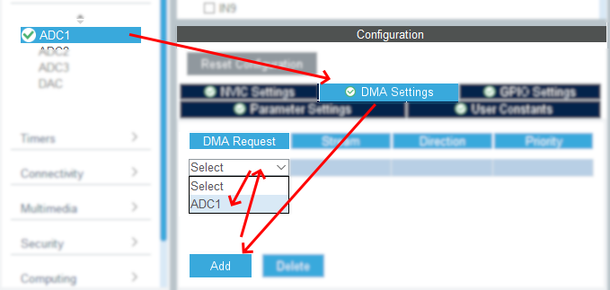
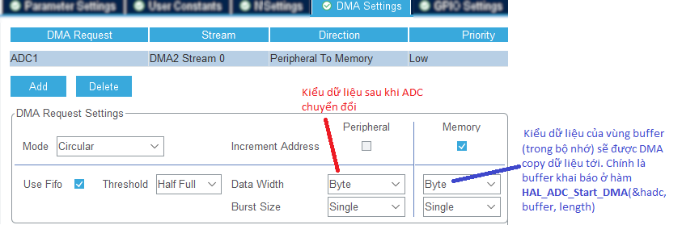

# ĐỌC DỮ LIỆU ANALOG BẰNG STM32F429

STM32 có sẵn __3 bộ ADC 12-bit__ với tốc độ mâu 2,4 MSPS, tức là có khả năng lấy được 2.4 triệu mẫu giá trị trong 1 giây, mỗi giá trị là một số nguyên 12-bit trong phạm vi từ [0,4095].


Chương trình sau hỗ trợ đọc dữ liệu đã chuyển đổi Analog To Digital theo cả **3 phương pháp** (Chi tiết xem ở học phần Kiến trúc Máy tính):

1. [__Polling/Hỏi vòng__](#thực-hiện-với-phương-pháp-polling): đặc trưng với 2 vòng lặp: vòng lặp xác định trạng thái sẵn sàng của thiết bị, và vòng lặp đọc mảng dữ liệu.
2. [__Interrupt/Ngắt__](#thực-hiện-với-phương-pháp-interrupt): đặc trưng với 1 vòng lặp đọc mảng dữ liệu. Trong đó trạng thái sẵn sàng do thiết bị gửi tín hiệu ngắt báo hiệu.
3. __DMA/Truy cập bộ nhớ trực tiếp__: đặc trưng với 0 vòng lặp. Trong đó trạng thái sẵn sàng do thiết bị gửi tín hiệu ngắt báo hiệu và bộ điều khiển DMAC chịu trách nhiệm copy dữ liệu từ thiết bị/module IO trực tiếp vào bộ nhớ chính.

>Chú ý: trong chương trình này, dữ liệu từ cảm biến chỉ có 1 word dữ liệu đơn nên sẽ không nhìn thấy vòng lặp đọc mảng dữ liệu, mà đơn giản chỉ là 1 lệnh HAL_ADC_GetValue()

## Ứng dụng

Phù hợp để áp dụng cho các module cảm biến có chân trả về __A0__ (chữ A có ý nghĩa là Analog). Ví dụ:

- Biến trở.\
  
- Module MQ-03 - cảm biến nồng độ cồn.\
   
- Module MQ-08 - cảm biến khi gas dễ cháy.\
    
- Module cường độ sáng.\
  
- Module âm thanh.\
  
- Biến trở
  

> Để đọc số liệu từ các dạng cảm biến này, chỉ cần cắm lại dây sang module cảm biến mới, mà không cần phải lập trình lại.

## Kết nối STM32F429 với module cảm biến

|STM32F429|Module cảm biến|
|:--:|:--:|
|3v3|Vcc|
|GND|GND|
|PA0 (đóng vai trò tín hiệu ngắt khi vượt ngưỡng)|D0|
|PA1|A0|

## Hướng dẫn sử dụng nhanh

Chương trình áp dụng cả 3 phương pháp thăm dò và đọc thông tin bằng [polling](#thực-hiện-với-phương-pháp-polling), [interrupt](#thực-hiện-với-phương-pháp-interrupt), dma. Để chuyển đổi giữa 3 phương pháp này, hãy __bỏ dòng chú thích__ cho dòng tương ứng trong file __main.h__

```C
  #define MY_ADC_POLLING     //Phương pháp Polling. Để sử dụng, bỏ comment dòng lệnh này và recomment các define tương tự
  #define MY_ADC_INTERRUPT   // Phương pháp Interrupt. Để sử dụng, bỏ comment dòng lệnh này và recomment các define tương tự
```

## Thực hiện với phương pháp Polling

1. Tạo dự án mới với __MCU__ là __STM32F429zIT6__\
  
2. Mở file __.ioc__, Chọn bộ __ADC__ sẽ sử dụng (ADC1, ADC2, hay ADC3). Ứng với bộ __ADC__ đó, chọn kênh đầu vào là __IN nào__ trong số 16 nguồn vào.\
  
3. Vẫn trong file __.ioc__, bổ sung thêm __UART1__ để truyền số liệu thu được về máy tính, phục vụ để debug.\
  *Lưu ý rằng: __UART1__ trên STM32 sẽ giao tiếp với máy tính qua chính cổng USB mini dùng để nạp chương trình, nên sẽ không cần cắm dây bổ sung.*\
  

4. Trong file __main.c__, khởi tạo biến để chứa giá trị analog đọc được.

    ```C
      uint16_t sensor_value;
    ```

5. Trong file __main.c__, thực hiện đọc số liệu với 3 bước:
    1. Yêu cầu __ADC__ chuyển đổi
    2. Chờ __ADC__ chuyển đổi xong
    3. Lấy giá trị từ __ADC__.
  
    ```C
    HAL_ADC_Start(&hadc1);
    HAL_ADC_PollForConversion(&hadc1, 20);
    sensor_value = HAL_ADC_GetValue(&hadc1);
    ```

## Thực hiện với phương pháp Interrupt

1. Như với polling
2. Như với polling
    - __2b Bổ sung__: Vẫn ở giao diện __ADC__ , trong mục __Configuration / NVIC Settings__, hãy __enable__ hộp chọn __ADC1, ADC2, and ADC3 global interrupts__.\
    
3. Như với polling
4. Như với polling
5. __Bỏ đoạn mã polling__ trong hàm main.c, và thay thế bằng xử lý handler trong sự kiện ngắt như sau.\
   Trong file __Src/stm32f4xx_it.c__, bổ sung vào hàm __ADC_IRQHandler()__

   ```C
    sensor_value = HAL_ADC_GetValue(&hadc1);
   ```

## Thực hiện với phương pháp Polling + DMA

Giả định rằng biến __sensor_value__ vẫn y hệt như ở phần Polling và Interrupt để tiện so sánh.

1. Mở file __.ioc__, vẫn trong __Pintout & Configuration__, trong __Collapse menu trái__, chọn bộ __ADC__ đã tích chọn trước đó.\
   Tiếp tục, trong mục __Configuration__, trong __tab DMA Setting__, bấm __Add__ và chọn __ADC__ đã chọn.
   \
   Vậy đã tạo xong một DMA Request với thông số mặc định.
2. Ở phần bên dưới của tab __DMA Settings__, hãy thiết lập các thông số như trong ảnh dưới, <span style="color:red"> __NHƯNG DataWidth = HalfWord__ ở cả Peripheral và Memory </span>, với lý do là vùng buffer, là biến  __sensor_value__, thuộc kiểu uint16_t 16-bit. \
    \
    > Lưu ý: 
    Vậy đã cấu hình xong một DMA Request.
3. Chuyển sang tab __Parameter Settings__, hãy thiết lập như trong ảnh\
   

4. Trong file __main.c__, bổ sung 1 lệnh để kích hoạt DMA. 
   > Trong ví dụ dưới, kiểu dữ liệu của biến __sensor_value__ sẽ liên quan tới cấu hình __DMA Request__ ở bước trên

   ```C
    /**
      * Kích hoạt ADC DMA request sau lần truyền cuối cùng (Chế độ Single-ADC) và kích hoạt thiết bị ngoại vi ADC,
      * trong đó sensor_value là địa chỉ đích, sẽ được DMA tự động copy dữ liệu từ thiết bị ngoại vi vào đó.
      * CHÚ Ý:
      * - Tham số 2: là ĐỊA CHỈ của buffer chứa kết quả, do ADC chuyển đổi và được DMAC copy vào.
      * - Tham số 3: là số phần tử của buffer, không phải là số byte. Ví dụ uint16_t buffer[20] thì tham số này là 20.
    */
    HAL_ADC_Start_DMA(&hadc1, &sensor_value, 1);
   ```

5. Vẫn trong file __main.c__, bổ sung hàm để hiển thị thông tin ra UART

  ```C
    /**
    * @brief Hàm sự kiện được gọi sau khi ADC chuyển đổi thành công dữ liệu
    *        và DMA hoàn tất copy dữ liệu vào đich
    * @note  ADC thực hiện với đồng hồ 48MHz, nhanh hơn nhiều so với core 12Mhz,
    */
    void HAL_ADC_ConvCpltCallback(ADC_HandleTypeDef *hadc){
      /// Truyền về máy tính để tiện giám sát số liệu
      sprintf(uart_buffer, "%s:: %d\r\n", UART_PROMT, sensor_value);
      HAL_UART_Transmit(&huart1, (uint8_t *)uart_buffer, strlen(uart_buffer), HAL_MAX_DELAY);
    }   
   ```

- Gợi ý cách để khai báo hàm này cho chính xác là:
  - Ở cửa sổ Project Explorer, mở thư mục Drivers\STM32F4xx_HAL_Driver\Src
  - Mở file stm32f4xx_hal_adc.c
  - Tìm file hoặc trong cửa sổ Outline và copy khai báo hàm vào đây
  - Xong. Đây là dạng hàm abtract, nên chỉ cần viết đè là xong.

## Kết quả

   [Video demo](https://youtube.com/shorts/wBLDlglATeg)
   
   
   
   Xem video [](https://youtube.com/shorts/AHpfNx5uESY?feature=share)